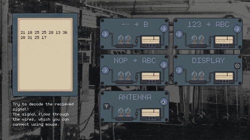

Wiretap je hra kde se snažíte vyluštit náhodně zakódovanou zprávu, kterou jste na svém příjmači zachytili. Zatím hra šifruje pouze pomocí tří jednoduchých šifer, ale do budoucna bych chtěl přidat šifry závislých na průběhu hry, formátu obdržené zprávy nebo jiných faktorech, podobně jako to dělá hra _Keep talking and nobody explodes_. Zatím je to ovšem jen prototyp nápadu mechaniky pro hru.

Naprogramoval jsem ji v rámci [Hackclub eventu Siege](https://siege.hackclub.com) kde tento projekt byl jedním z 10 na kterých jsem pracoval.
